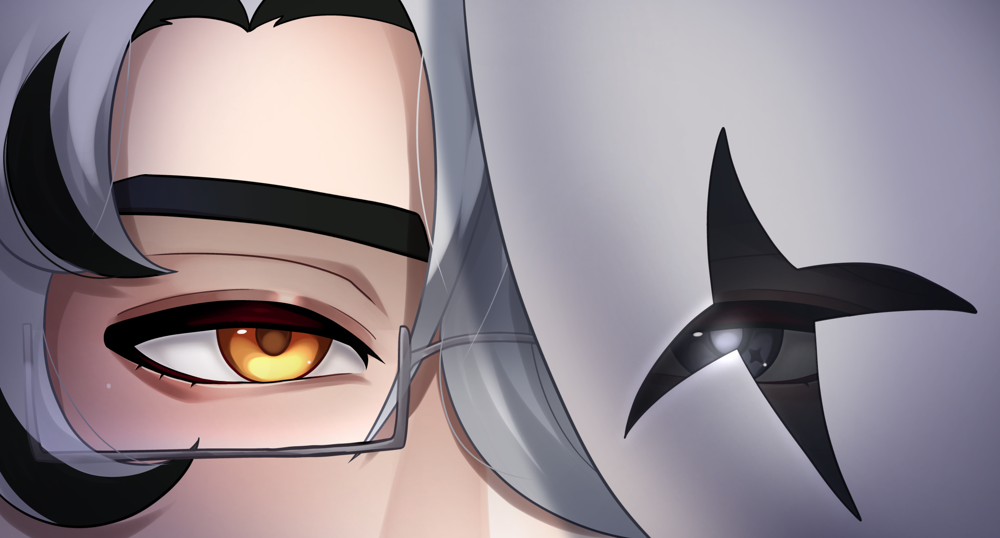
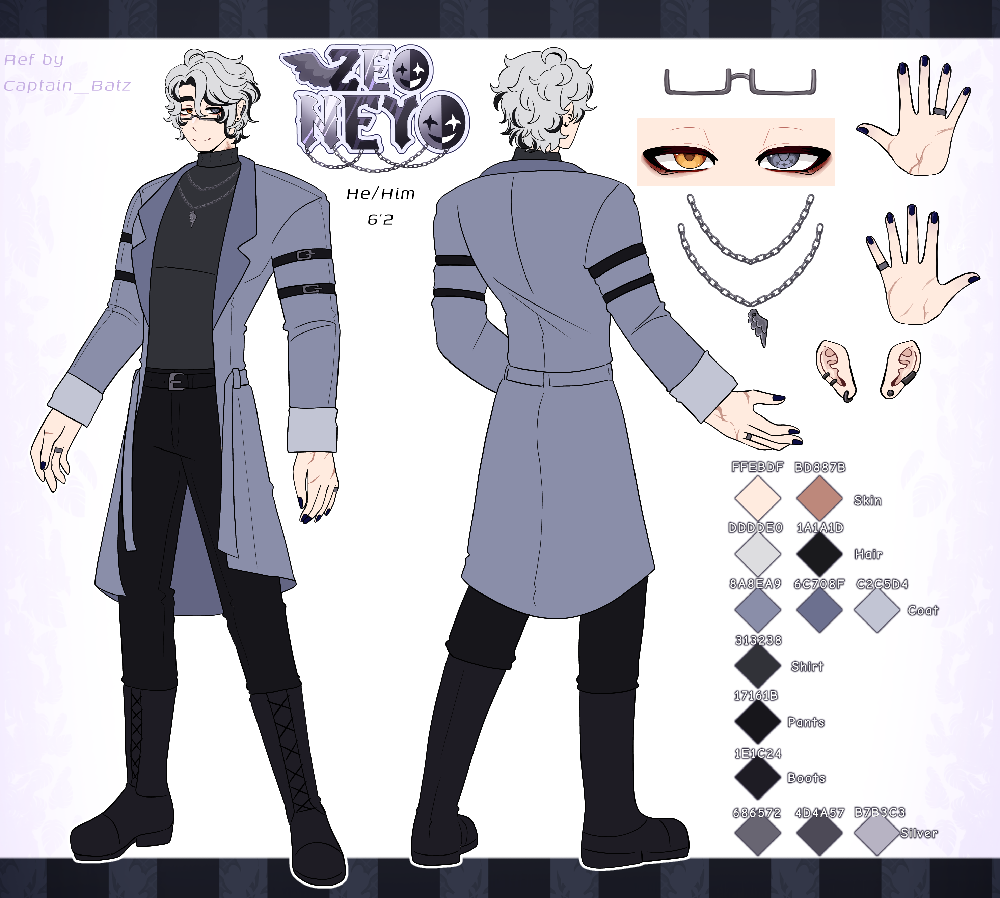

About Zeo Neyo

[Where to find Zeo Neyo.](socials.md)

---

<iframe width="560" height="315" 
  src="https://www.youtube.com/embed/BVttfEXAbNo" 
  title="YouTube video player" 
  frameborder="0" 
  allow="accelerometer; autoplay; clipboard-write; encrypted-media; gyroscope; picture-in-picture" 
  allowfullscreen>
</iframe>

---

 Who is Zeo Neyo?
- Zeo Neyo, is a demi-god VTuber with the power of the trickster "Mask of Sanity" on his side. Just what is the "Mask of Sanity"? Well, you first need to know what the "Masks of Sins" are to paint the full picture. To put it simply, the "Masks of Sins" are a cult that, Zeo Neyo is trying to take down. During the process, he have rescued the little heathens, people who were once controlled by the Masks.

- *He too was once trapped by the Mask of Sins...*

---

