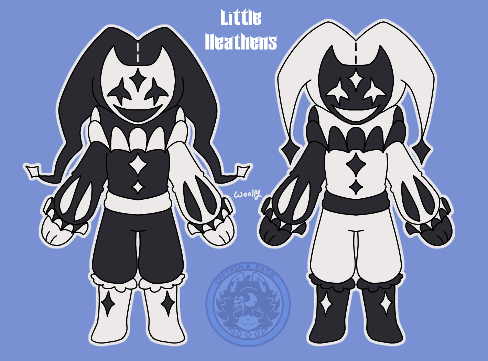

<h1 style="color: #ffffff !important;">Zeo Neyo</h1>

<h3 style="color: #ffffff !important;">🤍About Zeo Neyo🤍</h3>

> * Zeo, is a human professor who looked into why so many of his students were acting *weird*. Which is how he stumbled upon the Mask of Sin.
>
> * Neyo, is the Mask of Sanity, they carries the power of the tickster. Neyo was once part of the Mask of Sins, however, decided to leave the Mask of Sins because he didn't agree with their ideals. 
> 
> *When the cult found out they, casted him away...*   
---

 *Reference image*

<h3 style="color: #ffffff !important;">🖤Who is Zeo Neyo?🖤</h3>

 * A demi-god V-tuber, who's an over all amazing person, and a dreamer. He's community grew once he played the game "The Freak Circus".

  * Zeo Neyo's community has only grown ever since, the community called "Heathen's" by the creator. 

  * Heathen's were people who once followed the Mask of Sins
---

---

 *Credits to Captain_Batz*

